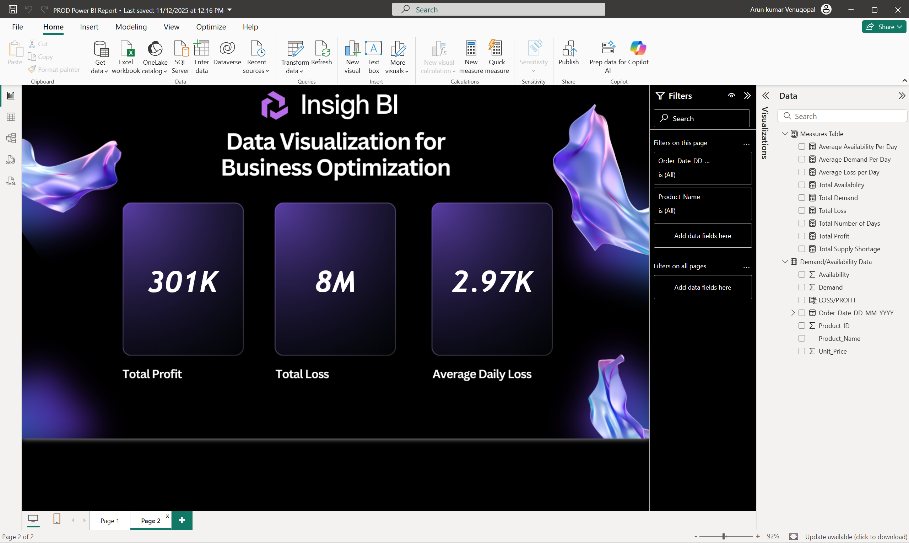

# Demand & Availability Analysis – End-to-End Power BI Project  
(SQL Server + MySQL)

### 📂 GitHub Repository
https://github.com/Arun-Kumar-Venugopal/Demand-Availability-Analysis-PowerBI

## Dashboard Overview
This project analyzes **product demand, availability, supply shortages, profit, and loss**
using an end-to-end Power BI workflow across **SQL Server and MySQL databases**.

## Business Context
This project helps **operations and supply chain teams** analyze demand versus availability across products and dates.
It identifies **supply shortages, excess inventory, profit, and loss trends** to improve inventory planning and business optimization.

## Problem Statement
The business faces challenges in balancing **product demand and availability**, leading to supply shortages
or excess inventory that impacts profitability.

## Key KPIs
- Average Demand per Day
- Average Availability per Day
- Total Supply Shortage
- Total Profit
- Total Loss
- Average Daily Loss

## Assumptions & Limitations
- Demand and availability are treated as daily aggregates
- Profit and loss calculations assume constant unit price
- Data refresh depends on source system availability

---

## Architecture
SQL Server / MySQL → Power BI Desktop (Model + DAX) → Power BI Service

- Single semantic model reused across report pages
- Same report transitioned between SQL Server and MySQL backends
- Published to separate workspaces for each data source

---

## Business Problem
Organizations need visibility into:
- Daily demand vs availability
- Supply shortages
- Profit and loss trends
- Product-level performance
- Data consistency across test and production environments

This dashboard helps stakeholders monitor operational efficiency
and make informed inventory decisions.

---

## Key Highlights
- Built an **end-to-end Power BI solution** using SQL Server and MySQL
- Implemented **test → production environment migration**
- Designed reusable **DAX KPI framework**
- Migrated report from **SQL Server to MySQL without rebuilding visuals**
- Validated metrics across multiple data sources

---

## Data Sources
- **SQL Server**
  - Test Environment
  - Production Environment
- **MySQL Database**
  - Production Environment

---

## Workflow Summary

### 1) Data Preparation (SQL Server)
- Imported inventory and product datasets
- Performed data quality checks
- Created reporting table using SQL **LEFT JOIN**

### 2) Power BI Desktop Modeling
- Loaded prepared table into Power BI Desktop
- Standardized data types
- Created calculated columns
- Designed report layout with custom backgrounds

### 3) KPI & DAX Development
- Created a dedicated **Measures Table**
- Implemented KPIs using DAX:
  - Average Demand per Day
  - Average Availability per Day
  - Total Supply Shortage
  - Total Profit
  - Total Loss
  - Average Daily Loss

### 4) Test → Production Transition
- Switched data source from **Test DB to Prod DB**
- Ensured schema consistency
- Validated metric accuracy

### 5) SQL Server → MySQL Migration
- Installed MySQL connector
- Recreated equivalent tables in MySQL
- Updated Power Query source using **Advanced Editor**
- Validated results across databases

### 6) Publishing
- Published reports to Power BI Service
- Created separate workspaces for SQL Server and MySQL sources

---

## Report Pages

### Page 1: Demand & Availability KPIs
- Average Demand per Day
- Average Availability per Day
- Total Supply Shortage
- Product & Date filters

---

### Page 2: Profit & Loss Analysis
- Total Profit
- Total Loss
- Average Daily Loss
- Product & Date filters

---

## DAX Concepts Used
- CALCULATE & FILTER
- SUMX for row-level calculations
- Time-based aggregations
- Conditional logic for profit/loss analysis

---

## Tools & Technologies
- Microsoft SQL Server & SSMS
- MySQL Server & MySQL Workbench
- Power BI Desktop
- Power BI Service
- DAX
- SQL

## ▶️ Live Demo (Power BI Service)
🔗 View-only reports published to Power BI Service  
(Microsoft login required)

- **SQL Server Data Source Report**:  
  https://app.powerbi.com/links/v6oAGXMnuK?ctid=4b05e781-4500-43c7-a12b-f7a45bcd4a54&pbi_source=linkShare

- **MySQL Data Source Report**:  
  https://app.powerbi.com/links/jzcVhIHipP?ctid=4b05e781-4500-43c7-a12b-f7a45bcd4a54&pbi_source=linkShare

> Note: Both reports use the same Power BI visuals and DAX logic.  
> The purpose is to demonstrate **data source migration from SQL Server to MySQL**
> without rebuilding the report.
---
## What I Learned
- Designing an end-to-end Power BI solution using multiple databases (SQL Server & MySQL)
- Handling test-to-production database migration without rebuilding reports
- Switching Power BI data sources using Power Query Advanced Editor
- Building reusable KPI measures using DAX
- Validating business metrics across different database platforms
- Managing separate Power BI workspaces for different data sources
- Publishing and maintaining reports in Power BI Service

## Author
Created by: **Arun Kumar Venugopal**
